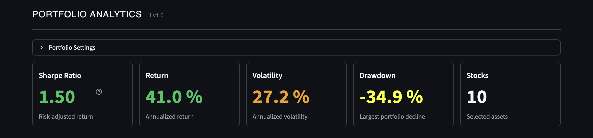
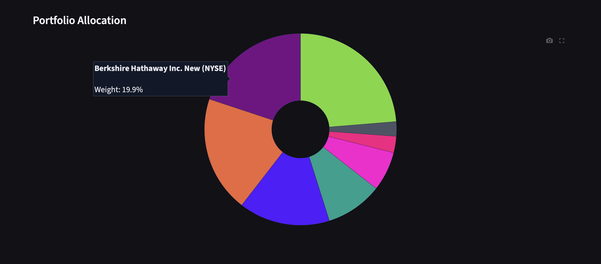
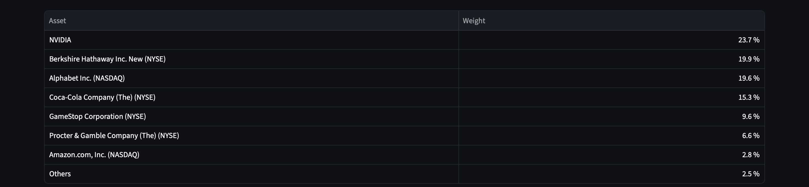
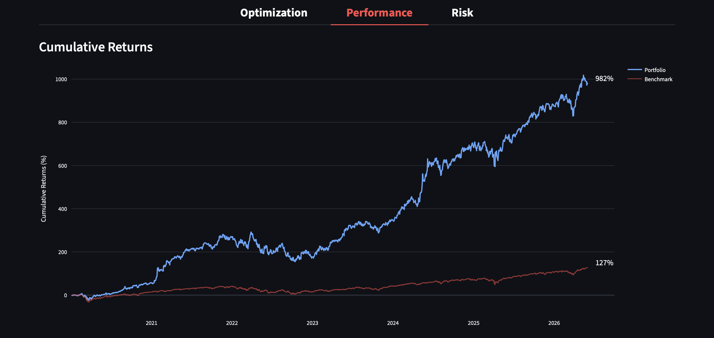
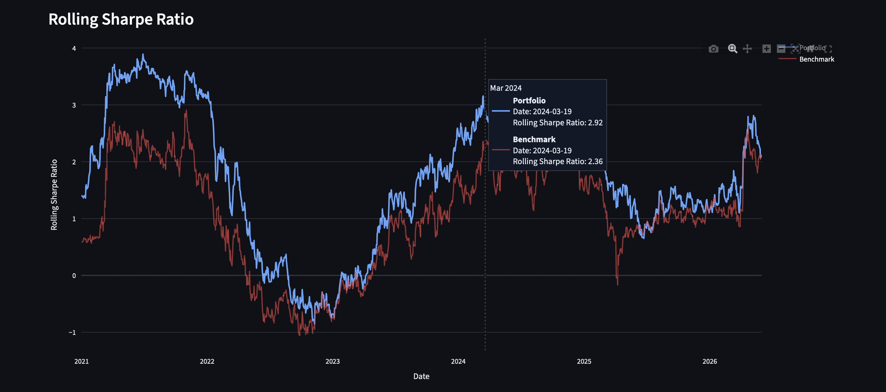
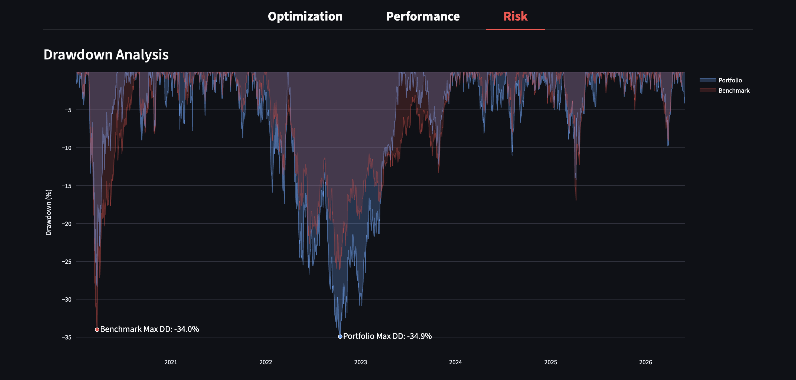
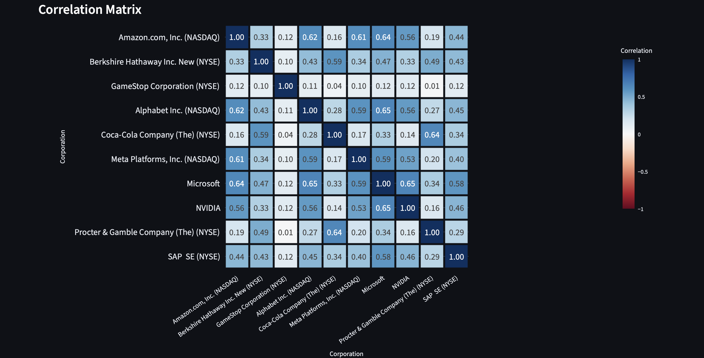

# Portfolio Analytics Dashboard v1.0

An interactive, high-performance quantitative finance dashboard built with Streamlit, Pandas, and Plotly. This application empowers investors to construct portfolios, simulate asset allocations via Modern Portfolio Theory (MPT), and execute deep-dive risk and performance benchmarking against major market indices.

## Key Features

* **Global Asset Engine:** Integrated Live API search tool parsing equities and ETFs directly via Yahoo Finance.
* **Monte Carlo Optimization:** Executes up to 100,000 parallel portfolio simulations to map out the Efficient Frontier and isolate the Maximum Sharpe Ratio configuration.
* **Adaptive Portfolio Allocation:** Dynamic asset rebalancing chart containing an automatic micro-position aggregation threshold (positions merge into an "Others" category to preserve visualization neatness).
* **Historical Benchmarking:** Side-by-side performance comparison against benchmark assets (SPY, QQQ, URTH) mapping cumulative returns.
* **Advanced Risk Diagnostics:**
  * Real-time multi-asset correlation matrices.
  * Historical peak-to-trough Drawdown Analysis tracking maximum structural losses.
  * Time-varying Rolling Sharpe Ratio curves (252-day window) evaluating active risk-adjusted consistency.

## Tech Stack

* **UI Framework:** Streamlit (Custom Darkmode injection via CSS overrides)
* **Data Pipelines:** yfinance API, Requests
* **Vectorized Math Engine:** NumPy, Pandas
* **Visualization Layer:** Plotly Express (Fully reactive, customized SVG/HTML graphing)

---

## 1. Mathematical Architecture

The core framework underlying this analytical application relies on mathematical formulations derived from Modern Portfolio Theory (MPT) introduced by Harry Markowitz, alongside modern risk management metrics.

### Multi-Asset Return and Covariance Engine
Daily asset returns are transformed into vectorized annualized parameters assuming 252 trading days per calendar year. Let $\mu$ be the daily return vector and $\Sigma$ be the daily covariance matrix of returns. The annualized expected return vector $R_{a}$ and covariance matrix $\Sigma_{a}$ are:

$$R_{a} = \mu \times 252$$
$$\Sigma_{a} = \Sigma \times 252$$

### Monte Carlo Simulation & Optimization
The system generates random weight vectors $\omega = [\omega_{1}, \omega_{2}, ..., \omega_{n}]^{T}$. For each simulation pass, weights are strictly normalized to fulfill the long-only budget constraint:

$$\sum_{i=1}^{n} \omega_{i} = 1 \quad \text{where} \quad \omega_{i} \ge 0$$

For each generated weight vector, the expected portfolio return $R_{p}$ and the overall portfolio volatility $\sigma_{p}$ are computed using linear algebra matrix operations:

$$R_{p} = \omega^{T} R_{a}$$
$$\sigma_{p} = \sqrt{\omega^{T} \Sigma_{a} \omega}$$

### Risk-adjusted Performance (Sharpe Ratio)
Assuming a risk-free rate of $R_{f} = 0$ (version 1.0), the maximum risk-adjusted performance optimization target is determined via:

$$\text{Sharpe Ratio} = \frac{R_{p} - R_{f}}{\sigma_{p}}$$

### Continuous Risk Diagnostics
The Max Drawdown (DD) monitors structural asset capital declines. Let $Y_{t}$ be the portfolio's cumulated value at time $t$. The drawdown trajectory is defined as:

$$DD_{t} = \frac{Y_{t} - \max_{\tau \le t}(Y_{\tau})}{\max_{\tau \le t}(Y_{\tau})}$$

Similarly to the Sharpe Ratio, the Rolling Sharpe Ratio is formed by dividing the difference of the arithmetic mean of the daily returns and the risk-free rate with the standard deviation of the daily returns. Note that instead of using a yearly average, the annualized rolling return and volatility are calculated dynamically.

---

## 2. Portfolio Analysis

In the following, a portfolio containing the shares of listed companies will be analyzed:
* Alphabet Inc.
* Amazon.com
* Berkshire Hathaway (B)
* Coca-Cola Company
* GameStop Corporation
* Meta Platforms
* Microsoft Corporation
* NVIDIA Corporation
* Procter & Gamble
* SAP

The Monte Carlo Simulation (10,000 random simulations; Jan. 1, 2020 – Feb. 6, 2026) indicates a rather high maximum Sharpe Ratio as well as a high annual return. However, this comes at the cost of higher volatility and a moderate drawdown.



### Asset Allocation & Structure
It implies an allocation mostly combining constantly well-performing and diversified companies, such as Berkshire Hathaway, Coca-Cola and Procter & Gamble, as well as recently out-performing shares of tech-giants like NVIDIA and Alphabet. With a share of almost 10%, GameStop's hyped share contributes a significant amount to the portfolio. Because Meta Platforms, Microsoft Corporation and SAP would only make up $\le 2\%$ of the allocation, they are listed in the category "Others".

 

*Figure 1: Maximum Sharpe Portfolio Allocation. Visual breakdown and tabulated shares of the optimized asset weights. Minor positions ($\le 2\%$) are dynamically aggregated into the "Others" category to ensure structural clarity.*

### 2.1. Historical Performance and Benchmarking
To evaluate the historical efficacy of the Maximum Sharpe Portfolio, a retrospective performance analysis was conducted for the period from January 1, 2020, to February 6, 2026. The optimized portfolio's cumulative returns are benchmarked against the broad market index (MSCI World) to measure structural outperformance and tracking behavior under various market regimes.

As visualized below, the strategic allocation successfully captured strong secular tailwinds, primarily driven by the significant alpha generated by mega-cap technology exposure and the tactical inclusion of high-momentum assets. Throughout the observed timeline, the optimized portfolio demonstrates a persistent trajectory of outperformance relative to the benchmark, validating the risk-adjusted scaling achieved through the Monte Carlo simulation.


*Figure 2: Cumulative Returns vs. Benchmark. Comparative growth path of the optimized Maximum Sharpe Portfolio (blue) against the selected market benchmark (red) from 2020 to 2026. Returns are plotted as percentage growth, demonstrating a substantial performance spread over the long term.*

### 2.3 Consistency of Risk-Adjusted Returns (Rolling Sharpe Ratio)
While cumulative returns illustrate absolute growth, they do not reflect whether the performance was achieved through structural efficiency or highly volatile, short-term surges. To analyze the temporal consistency of the portfolio's risk-adjusted outperformance, a 252-day moving window was utilized to calculate the rolling Sharpe Ratio.

The rolling analysis reveals that the optimized portfolio maintained a superior risk-adjusted profile compared to the benchmark across the majority of the observed market regimes. Even during macroeconomic shifts and periods of heightened market compression, the portfolio's rolling metric consistently rebounded faster and remained predominantly above the zero-line. This cyclical persistence proves that the allocation model successfully maximized diversified returns per unit of portfolio volatility, rather than just taking on uncompensated beta.


*Figure 3: 252-Day Rolling Sharpe Ratio. Time-varying risk-adjusted performance of the optimized portfolio (blue) versus the benchmark index (red). The dashed gray line indicates a Sharpe Ratio of zero, serving as the threshold for positive risk-adjusted excess returns.*

### 2.4 Risk Diagnostics and Structural Vulnerability
To achieve a comprehensive understanding of the portfolio's risk profile, the final dimension of the analysis focuses on structural downside vulnerability and underlying asset dependencies.

The Drawdown Analysis evaluates the historical peak-to-trough declines, charting the continuous "underwater" periods of both the portfolio and the benchmark. While the optimized portfolio generated significant alpha, it also experienced a maximum drawdown of -34.9%, driven by the high-beta technology exposure and momentum stocks like GameStop. However, the recovery timeline aligns closely with the broader market, indicating that the portfolio's drawdowns were cyclical rather than structural collapses.

The major difference does not lie in the drawdown's strength but in the occurring date. In comparison to the benchmark, which experienced a similar drawdown of -34.0% in 2020, the portfolio's maximum drawdown happened in 2022, caused by the weakening of tech-stocks because of rapidly increasing interest rates and the fall of meme-stocks like GameStop.


*Figure 4: Historical Drawdown Analysis. Visual representation of peak-to-trough capital declines for the optimized portfolio (blue) and the benchmark (red). Shaded areas illustrate the depth and duration of recovery periods from all-time highs.*

The structural resilience behind these metrics is explained by the Correlation Matrix. By balancing hyper-growth tech giants (e.g., NVIDIA, Alphabet) with low-correlation, defensive staples (e.g., Coca-Cola, Procter & Gamble, Berkshire Hathaway), the allocation mechanism effectively exploited diversification benefits. The statistical decoupling between these asset classes successfully mitigated systemic tail risk, ensuring that idiosyncratic shocks from individual speculative holdings did not destabilize the aggregate portfolio architecture.


*Figure 5: Statistical matrix mapping the Pearson correlation coefficients among the selected portfolio constituents. The color spectrum from blue (positive correlation) to red (negative correlation) illustrates the structural diversification potential within the basket.*

---

## 3. How to Run

To run this analytics dashboard on your local machine, follow these three simple steps:

### 1. Clone the Repository & Navigate
Open your terminal or command prompt, clone this repository, and switch into the project directory:
```bash
git clone [https://github.com/JuSt2711/Portfolio-Analytics-Dashboard.git](https://github.com/JuSt2711/Portfolio-Analytics-Dashboard.git)
cd Portfolio-Analytics-Dashboard
```

### 2. Install Dependencies
Install all required libraries using `pip`:
```bash
pip install streamlit numpy pandas yfinance plotly requests
```

### 3. Launch the Dashboard
Start the local Streamlit server:
```bash
streamlit run app.py
```